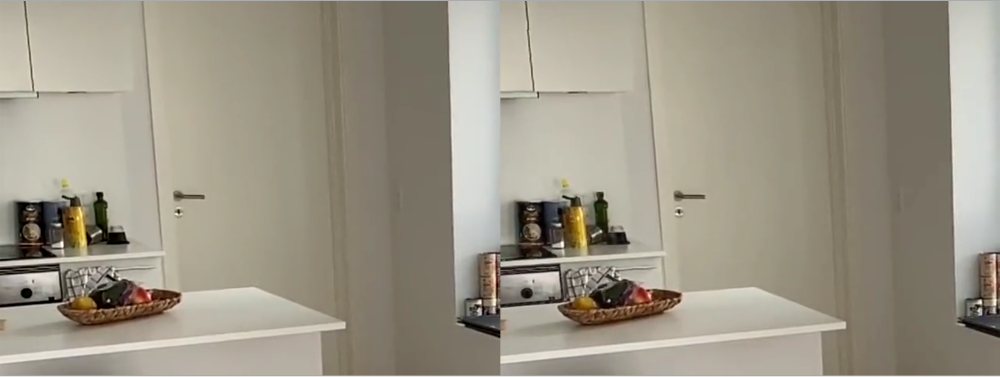
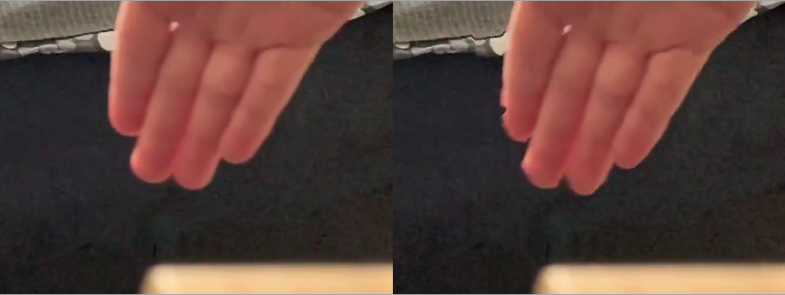
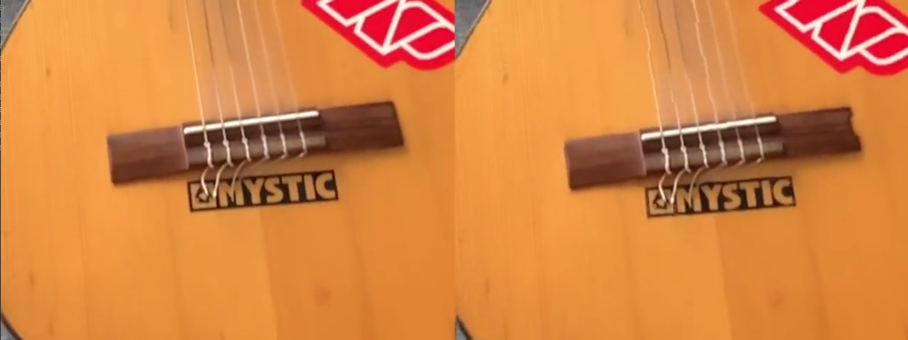

# Frame Rate Booster

This is a tool for motion-compensated temporal upsampling of frame sequances in the form of videos. Frame interpolation is carried out with the use of optical flow. To obtain the optical flow for two consecutive frames, the [Farneback](http://www.diva-portal.org/smash/get/diva2:273847/FULLTEXT01.pdf) method is used.

## Description

This tool was created in the scope of a project for the Digital Video Technology course at the Technical University of Denmark. This project is focused on the methods and techniques used to increase the frame rate of a video by creating new frames in between two consecutive images in a sequence. It is a relevant problem in many branches of the digital video technology field. For example, it can be used to transmit a sequence over a low bandwidth connection more effectively by first removing some frames from the video and then deconstructing them on the receiving end. It is also used in modern video editing software for slow-motion renders of videos that were shot with insufficient frame rate for that purpose. Yet another example can be old footage restoration.

In this project optical flow was calculated for each pair of consecutive frames. Optical  flow  is  a  field  of  2D  vectors  that  carry  the  information  of  how  the  pixels  move  between the frames. It was then used to interpolate the intermediate position of pixels along the motion vectors. The method was evaluated by first downsampling a sequance of images and then upsampling with the proposed method. Then the original and interpolated frames were compared using the Peak Signal-to-Noise Ratio (PSNR) metric. An in-depth description of the project, methods and results can be found [here](https://www.student.dtu.dk/~s192771/DigitalVideoTechnology.pdf).

Comparison of the original (left) and interpolated (right) frames for the test sequances:



<!-- TODO: Add GIF of original and downsampled & upsampled video for a demo -->

## Getting Started

### Dependencies

- [Python](https://www.python.org/) 3.9.4 or newer
- [OpenCV-Python](https://pypi.org/project/opencv-python/) 4.5.1.48 or newer
- [NumPy](https://pypi.org/project/numpy/) 1.19.5 or newer
- [Python Colormath](https://pypi.org/project/colormath/) 1.19.5 or newer

### Installing

- Clone or download this repository

### Executing program

- Set inputVideoName to a path to the video that you want to upsample and outputVideoName to where the upsampled video should be saved
- Run the program with the command:
```
python [path-to-repo]/farneback.py
```

## Further work

- Motion vector post processing based on image segmentation
- Use the vectors extracted from compression as initial optical flow
- Blend the forward and backward flow depending on the color difference
- Ability to interpolate more than one frame per each pair of existing frames

## Authors

Mateusz Sadowski
[mateusz.sadowski1@gmail.com](mateusz.sadowski1@gmail.com)
[linkedin.com/in/mateuszsadowski1/](https://www.linkedin.com/in/mateuszsadowski1/)

## License

This project is licensed under the MIT License - see the LICENSE.md file for details.

## Acknowledgments

* [README-Template](https://gist.github.com/DomPizzie/7a5ff55ffa9081f2de27c315f5018afc)